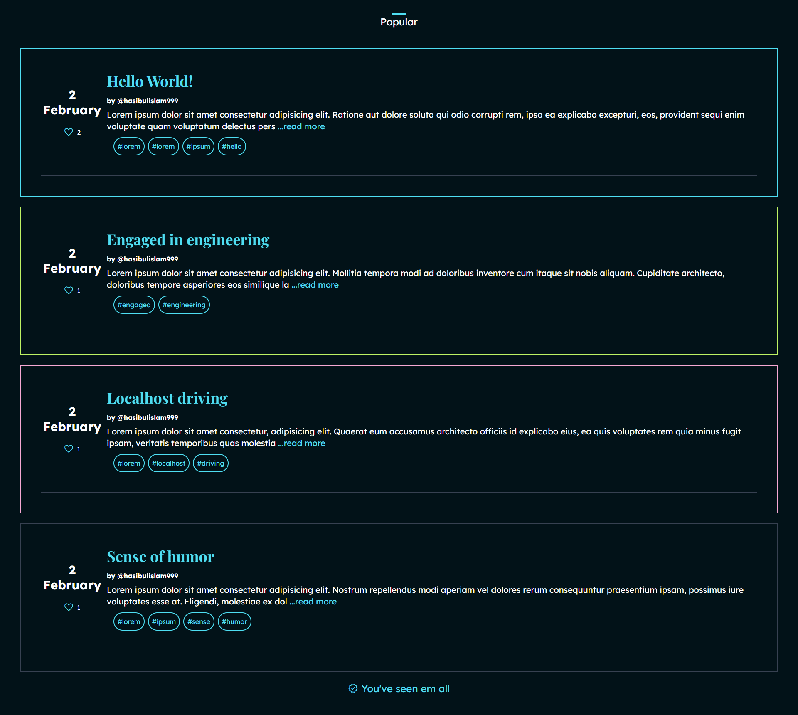
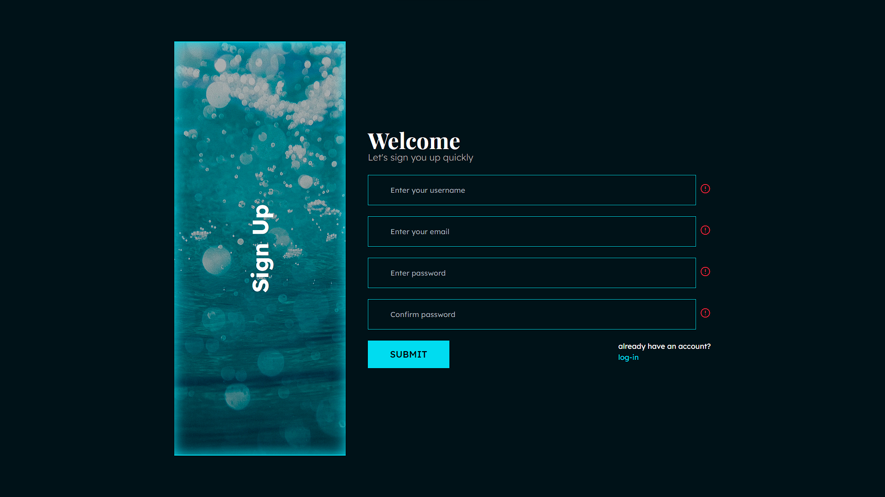

# nLog

> _Natural Way Of Blogging. By writing politically incorrect things uwu_

# Watch the shorts

> YouTube Shorts here: [Click Me](https://www.example.com)

# Blog operation

- [x] Sign up
- [x] Sign in
- [x] Create Post
- [x] Search Post
- [x] Static Sidebar
- [x] Static Bottom bar
- [ ] Deployment

## Try sign in

- Email: `hasib143sl@gmail.com` or `sadiadhira01@gmail.com`
- Password: `HasibulIslam1999` or `SadiaKhanumDhira2000`

## Built using ( MERN STACK )


## Screen-shots ( Aesthetic and Mild UI )

**Design File: [Checkout at Figma](https://www.figma.com/community/file/1118764549305878223)**





## Installation

1. **Make sure you have Node.js v16 or above**
2. **Make sure you have npm (node package manager)**

```bash
git clone https://github.com/hasibulislam999/9T5--nLog-blogs.git
```

```bash
cd nLog
```

```bash
cd client
```

```bash
npm install
```

```bash
cd ..
```

```bash
cd server
```

```bash
npm install
```

```bash
cd ..
```

## Configuration

### Server

```bash
cd server
```

```bash
touch .env
```

```bash
nano .env
```

```bash
DB_URL=mongodb://localhost:27017
ACCESS_TOKEN_SECRET=4e4accfab08403dbbfdee2dffe7f55a5
REFRESH_TOKEN_SECRET=da79b5ae074b1daa7484ad79f536c62e
PORT=3000
ALLOWED_ORIGIN=http://localhost:3000
NODE_ENV=production
```

**You can generate ACCESS_TOKEN_SECRET, REFRESH_TOKEN_SECRET using https://nodejs.org/api/crypto.html**

### Client

```bash
cd client
```

```bash
touch .env
```

```bash
nano .env
```

```bash
REACT_APP_BASE_URL=http://localhost:3000
```

## Running the application

### Development

`Run individually client and server on different ports ( Make sure to configure ports in above Configuration (.env files))`

```bash
npm run start
```

### Production

`Build client and run both client and server on same ports (This method can vary depending on how you choose to deploy )`

```bash
npm run build
```

## How to deploy the app on VPS (Virtual Private Server) ?

`I recommend the following tutorials`

- https://www.youtube.com/watch?v=Nxw2j1-srVc
- https://github.com/safak/youtube/tree/mern-deployment

## Special Thanks

1. Favicon: Photo by <a href="https://unsplash.com/@evieshaffer?utm_source=unsplash&utm_medium=referral&utm_content=creditCopyText">Evie S.</a> on <a href="https://unsplash.com/?utm_source=unsplash&utm_medium=referral&utm_content=creditCopyText">Unsplash</a>
2. Login & Sign-Up Screen: Photo by <a href="https://unsplash.com/@simebasioli?utm_source=unsplash&utm_medium=referral&utm_content=creditCopyText">Sime Basioli</a> on <a href="https://unsplash.com/?utm_source=unsplash&utm_medium=referral&utm_content=creditCopyText">Unsplash</a>

## Author

**Hasibul Islam**

- My Portfolio -> https://hasibulislam999.vercel.app
- My Github -> https://github.com/hasibulislam999
